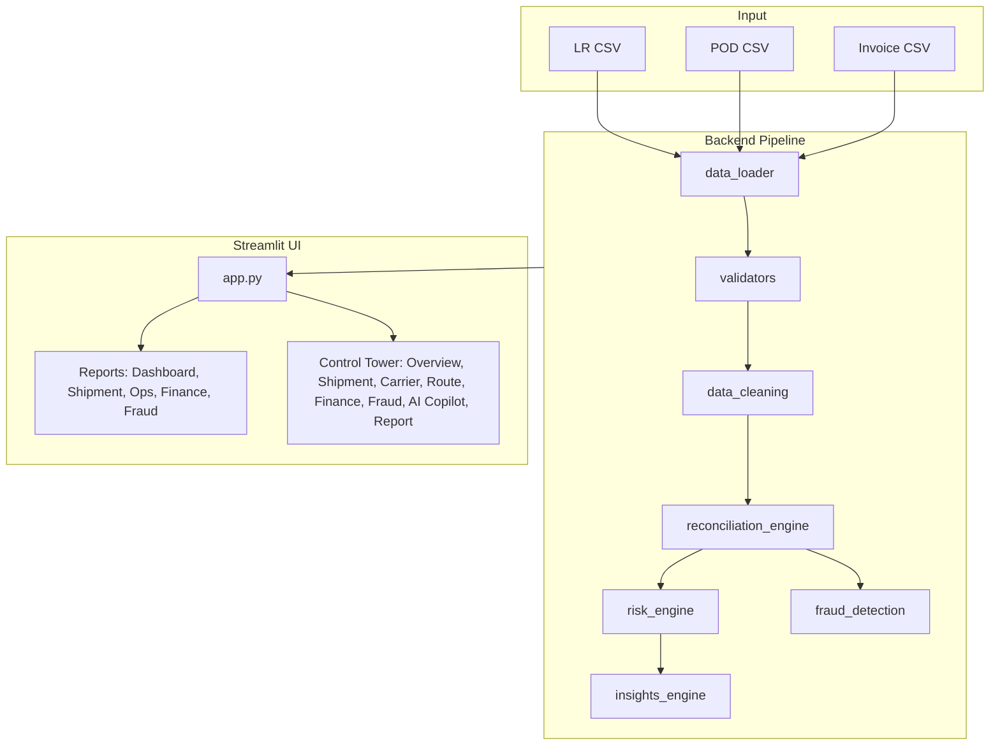
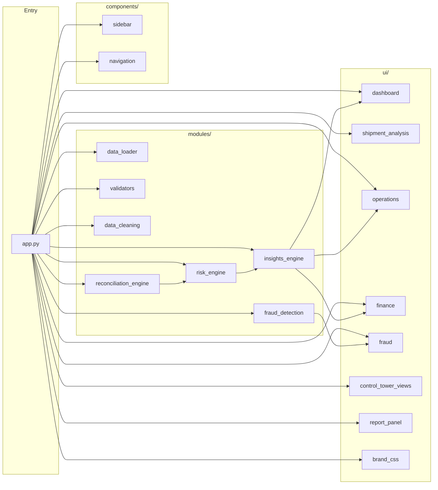
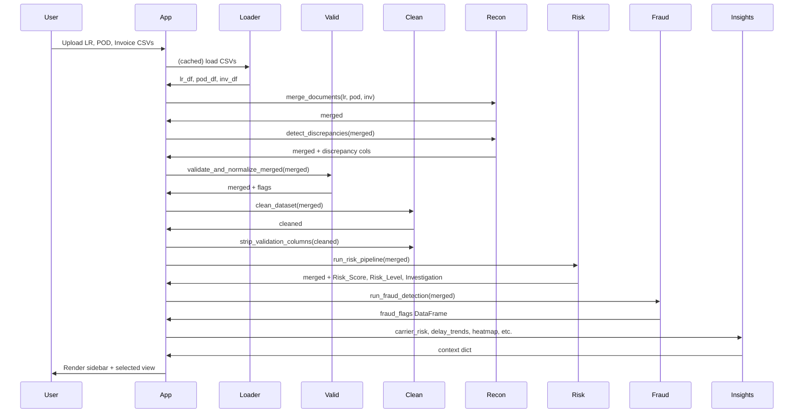

# FreightLens Intelligence Console

**AI-Powered LR–POD–Invoice Reconciliation System**

*Building the Digital Backbone of Logistics*

**FreightLens** is the official product name.

---

## Team Members

- **Abizer Masavi**
- **Megha Gala**
- **Nischay Mishra**
- **Suranjan Suryawanshi**

---

## Table of Contents

- [Overview](#overview)
- [Product Features](#product-features)
- [Architecture](#architecture)
- [Project Structure](#project-structure)
- [Tech Stack](#tech-stack)
- [Installation](#installation)
- [Running the Application](#running-the-application)
- [Data Generation](#data-generation)
- [Data Schema](#data-schema)
- [Pipeline & Modules](#pipeline--modules)
- [UI & Navigation](#ui--navigation)
- [Intelligence Report (PDF)](#intelligence-report-pdf)
- [Brand & Theming](#brand--theming)
- [Configuration](#configuration)
- [License](#license)

---

## Overview

The **FreightLens Intelligence Console** is a production-style prototype for logistics document analysis. It ingests **LR (Lorry Receipt)**, **POD (Proof of Delivery)**, and **Invoice** datasets, merges them, detects discrepancies, computes risk scores, runs fraud checks, and surfaces operational and financial insights through a Streamlit dashboard.

**Key capabilities:**

- **LR, POD, and Invoice ingestion** via CSV upload
- **Data validation and cleaning** (realistic bounds, outlier handling)
- **Reconciliation** (merge on Shipment ID, discrepancy detection)
- **Weighted risk scoring** (quantity, invoice, delay, weight, missing POD/signature)
- **Four-level risk classification** (Low, Medium, High, Critical)
- **Fraud detection** (duplicate invoices, repeated driver/carrier anomalies, cost inflation, repeated missing PODs)
- **Operational analytics** (carrier/driver/lane risk, delay trends, POD compliance)
- **Executive dashboard** and **FreightLens Control Tower** views (Overview, Shipment Intelligence, Carrier Analytics, Route Intelligence, Financial Risk, Fraud Detection, AI Logistics Copilot)
- **Enterprise Intelligence Report** – generate a full multi-section PDF report (executive summary, shipment/carrier/route/financial/fraud analytics, AI insights) with one click and download

The system is built for **FreightLens**: professional, data-driven, and hackathon-ready.

---

## Product Features

This section summarizes the complete FreightLens feature set in one place.

- **Multi-document ingestion:** Upload LR, POD, and Invoice CSVs and process them in a single workflow.
- **Data quality engine:** Validate and normalize logistics records with bounds checks, consistency checks, and cleaning.
- **Automated reconciliation:** Merge records by `Shipment_ID` and surface quantity, amount, weight, delay, and POD/signature mismatches.
- **Risk intelligence:** Compute weighted risk scores and classify shipments into Low, Medium, High, and Critical.
- **Fraud and compliance detection:** Flag duplicate invoices, repeated carrier/driver anomalies, suspicious cost patterns, and repeated missing PODs.
- **Operational command center:** Analyze risk by carrier, driver, route, delay trends, and POD compliance in dedicated views.
- **Financial exposure analytics:** Track invoice leakage drivers and summarize potential recoverable value.
- **AI investigation support:** Generate structured shipment investigations and actionable recommendations for operations teams.
- **Control Tower experience:** Navigate modern dashboard views across overview, shipment, carrier, route, financial, fraud, and copilot surfaces.
- **One-click intelligence report:** Generate and download a branded multi-section PDF report for leadership and audit readiness.
- **Enterprise UI branding:** Uses FreightLens theme, responsive SaaS-style sidebar, compact responsive top banner, and product favicon.

---

## Architecture

### High-Level Data Flow



### Module Dependency Diagram



### Pipeline Sequence (After Upload)



---

## Project Structure

```
.
├── app.py                    # Streamlit entry; upload, pipeline, sidebar + navigation
├── generate_datasets.py      # CLI to generate LR, POD, Invoice CSVs
├── requirements.txt          # Python dependencies
├── logo-Photoroom.png        # FreightLens logo (sidebar)
├── assets/
│   └── web_banner.png        # Responsive top banner image
├── run_app.bat               # Windows batch script to run app
├── run_app.ps1               # PowerShell script to run app
├── README.md                 # This file
├── .gitignore
│
├── .streamlit/
│   └── config.toml           # Theme (primary green, background, font)
│
├── components/               # Sidebar and navigation
│   ├── __init__.py
│   ├── navigation.py         # Nav items, session-state keys, page name mapping
│   └── sidebar.py            # Logo, Reports dropdown, Control Tower nav buttons
│
├── styles/
│   └── sidebar.css           # Sidebar layout, logo, buttons, section labels
│
├── modules/                  # Backend logic
│   ├── __init__.py
│   ├── data_loader.py        # Load LR, POD, Invoice CSVs
│   ├── data_cleaning.py      # clean_dataset(), strip_validation_columns()
│   ├── validators.py         # Validation rules; flag, normalize, log
│   ├── reconciliation_engine.py  # merge_documents(), detect_discrepancies()
│   ├── risk_engine.py        # Weighted risk score, 4 levels, recommendations, investigation
│   ├── fraud_detection.py    # Duplicate/repeated/suspicious detection
│   ├── insights_engine.py   # Carrier/driver/lane risk, heatmap, delay, POD compliance
│   └── report_generator.py  # PDF intelligence report (ReportLab + Matplotlib)
│
└── ui/                       # Streamlit UI
    ├── __init__.py
    ├── brand_css.py          # Brand CSS, tagline, main-area styles
    ├── dashboard.py          # Executive Dashboard (metrics + charts)
    ├── shipment_analysis.py  # Shipment Risk Analysis (table, drill-down)
    ├── operations.py        # Operational Intelligence (carrier, driver, lane, delay, POD)
    ├── finance.py            # Financial Intelligence (exposure, heatmap, charges)
    ├── fraud.py              # Fraud & Compliance (flagged shipments)
    ├── control_tower_views.py # Control Tower: Overview, Shipment, Carrier, Route, Finance, Fraud, AI Copilot
    └── report_panel.py       # Generate Intelligence Report panel (progress + PDF download)
```

---

## Tech Stack

| Layer        | Technology |
|-------------|------------|
| Frontend    | Streamlit |
| Backend     | Python 3.x |
| Data        | pandas, numpy |
| Charts      | Plotly (plotly.express), Matplotlib (PDF report) |
| PDF Report  | ReportLab, Matplotlib |
| Fonts       | Google Fonts (Poppins, Source Sans Pro) |
| Logging     | Python `logging` |
| Caching     | `@st.cache_data` for pipeline |

---

## Installation

1. **Clone the repository**

   ```bash
   git clone <repository-url>
   cd AI-Document-Intelligence-LR-POD-Invoice-Matching-Agent_LogisticsNow-Hackathon
   ```

2. **Create a virtual environment (recommended)**

   ```bash
   python -m venv venv
   # Windows
   venv\Scripts\activate
   # Linux/macOS
   source venv/bin/activate
   ```

3. **Install dependencies**

   ```bash
   pip install -r requirements.txt
   ```

   Core dependencies: `streamlit`, `pandas`, `numpy`, `plotly`, `reportlab`, `matplotlib`.

---

## Running the Application

**Option 1 – Command line**

```bash
streamlit run app.py --server.port 8501
```

Or with headless mode (no email prompt):

```bash
streamlit run app.py --server.port 8501 --server.headless true
```

**Option 2 – Scripts**

- **Windows (batch):** double-click `run_app.bat` or run `run_app.bat` from a terminal.
- **PowerShell:** `.\run_app.ps1`

**Open in browser:** `http://localhost:8501`

Then upload the three CSVs (LR, POD, Invoice) to run the pipeline and use the dashboard.

---

## Data Generation

Sample datasets can be generated with the same schema expected by the app.

**Basic usage (250 rows, current directory):**

```bash
python generate_datasets.py
```

**Options:**

| Option      | Description |
|------------|-------------|
| `--rows N` | Number of shipments (default: 250) |
| `--output DIR` | Output directory for CSVs (default: current directory) |

**Examples:**

```bash
python generate_datasets.py --rows 500
python generate_datasets.py --output ./data
python generate_datasets.py --rows 100 --output ./samples
```

**Output files:** `lr_dataset.csv`, `pod_dataset.csv`, `invoice_dataset.csv`

The generator produces realistic patterns: popular routes (e.g. Mumbai–Pune), weight-based freight, invoice logic (fuel surcharge, tax), anomalies (missing POD, delays, mismatches), and Maharashtra city coordinates for POD.

---

## Data Schema

### LR Dataset (`lr_dataset.csv`)

| Column             | Description |
|--------------------|-------------|
| Shipment_ID        | Unique shipment key |
| LR_Number          | Lorry receipt number |
| Transport_Company  | Carrier name |
| Vehicle_Number     | Vehicle ID |
| Driver_Name        | Driver name |
| Origin             | Origin city |
| Destination        | Destination city |
| Dispatch_Date      | Dispatch date |
| Material           | Material type |
| Package_Count      | Number of packages |
| Weight_KG          | Weight in kg |
| Charged_Weight     | Charged weight (e.g. volumetric) |
| Freight            | Freight amount |
| Loading_Charges    | Loading charges |
| Unloading_Charges  | Unloading charges |
| Total_LR_Amount   | Total LR amount |

### POD Dataset (`pod_dataset.csv`)

| Column             | Description |
|--------------------|-------------|
| Shipment_ID        | Links to LR/Invoice |
| Delivery_ID        | Delivery reference |
| Delivery_Date       | Delivery date |
| Status             | e.g. Delivered, Pending |
| Received_Packages  | Packages received |
| Receiver_Name      | Receiver name |
| Latitude           | Delivery latitude |
| Longitude          | Delivery longitude |
| Signature_Available| Yes/No |

### Invoice Dataset (`invoice_dataset.csv`)

| Column               | Description |
|----------------------|-------------|
| Shipment_ID          | Links to LR/POD |
| Invoice_ID           | Invoice reference |
| Invoice_Date         | Invoice date |
| Carrier_Name         | Carrier name |
| Freight_Charge       | Freight charge |
| Fuel_Surcharge       | Fuel surcharge |
| Subtotal             | Subtotal |
| Tax                  | Tax amount |
| Total_Invoice_Amount | Total invoice amount |

---

## Pipeline & Modules

### 1. `data_loader.py`

- **`load_lr_pod_invoice(lr_file, pod_file, invoice_file)`**  
  Returns `(lr_df, pod_df, inv_df)` from CSV file-like objects.

### 2. `validators.py`

- **`validate_and_normalize_merged(merged)`**  
  Applies: freight positive, invoice difference cap, delivery delay bounds, weight/package consistency. Adds validation flags and normalizes; logs warnings.

### 3. `data_cleaning.py`

- **`clean_dataset(df)`**  
  Outlier handling (IQR), null handling, numeric validation, realistic bounds.
- **`strip_validation_columns(df)`**  
  Drops internal `_*` columns before UI/analytics.

### 4. `reconciliation_engine.py`

- **`merge_documents(lr, pod, invoice)`**  
  Left joins on `Shipment_ID` (LR–POD–Invoice).
- **`detect_discrepancies(merged)`**  
  Adds: Quantity_Difference, Expected_Amount, Invoice_Difference, Weight_Difference, Delivery_Delay_Days, Missing_Signature, POD_Missing.

### 5. `risk_engine.py`

- **`compute_risk_score(merged)`**  
  Weighted formula: quantity×5 + invoice_scaled×3/1000 + delay×4 + weight×2/100 + missing_sig×20 + missing_pod×30. Adds Risk_Score, Risk_Level (Low/Medium/High/Critical).
- **`add_recommendations(merged)`**  
  Adds Recommended_Action per row.
- **`generate_investigation(row)`**  
  Returns structured dict: Shipment_ID, Detected_Issues, Operational_Impact, Financial_Risk, Suggested_Action.
- **`run_risk_pipeline(merged)`**  
  Runs score, level, recommendations, and investigations.

### 6. `fraud_detection.py`

- **`run_fraud_detection(merged)`**  
  Returns DataFrame of flagged shipments (Shipment_ID, Reason, Severity). Detects: duplicate invoices, repeated driver anomalies, repeated carrier mismatches, suspicious cost inflation, repeated missing PODs.

### 7. `insights_engine.py`

- **`carrier_risk_score(merged)`**, **`driver_risk_score(merged)`**, **`lane_risk_score(merged)`**
- **`financial_exposure_heatmap_data(merged)`**
- **`suspicious_carrier_detection(merged)`**, **`shipment_delay_trends(merged)`**
- **`pod_compliance_rate(merged)`**, **`auto_investigation_summary(merged)`**

---

## UI & Navigation

### Sidebar

- **FreightLens logo** (static, top center; compact)
- **Reports** (heading)  
  - **View** dropdown: Executive Dashboard, Shipment Risk Analysis, Operational Intelligence, Financial Intelligence, Fraud & Compliance
- **Navigation** (heading)  
  - Buttons: Overview, Shipment Intelligence, Carrier Analytics, Route Intelligence, Financial Risk, Fraud Detection, AI Logistics Copilot, **Generate Intelligence Report**

Sidebar theme: white background, light green/soft grey nav buttons, green active state; styling in `styles/sidebar.css` and `.streamlit/config.toml`.

### Reports Views

- **Executive Dashboard:** Top metrics (Total Shipments, High/Critical Risk, Financial Exposure, POD Compliance %); Risk distribution; Carrier risk ranking; Delay distribution; Financial risk breakdown; Auto investigation summary.
- **Shipment Risk Analysis:** Filter by risk level; risk table; shipment drill-down with structured AI investigation.
- **Operational Intelligence:** Carrier/Driver/Lane risk scores; delay trends; POD compliance %.
- **Financial Intelligence:** Financial exposure; freight cost composition; financial exposure heatmap.
- **Fraud & Compliance:** Flagged shipments table; duplicate invoices; missing POD/signature.

### Control Tower Views

- **Control Tower:** Hero metrics (shipments, risk counts, financial exposure, avg delay); brand values footer.
- **Shipment Intelligence:** Shipment map (Lat/Long, risk-colored); Logistics Alert Center (missing POD, delay, invoice/package mismatch).
- **Carrier Analytics:** Carrier leaderboard; Top risky carriers; Best performing carriers.
- **Route Intelligence:** Most delayed routes; Most risky routes; Highest volume routes.
- **Financial Risk:** Cost leakage (invoice/weight/package mismatch); Potential Recoverable Amount; heatmap table.
- **Fraud Detection:** Drivers with highest risk; Carriers with repeated mismatches; Routes with frequent delays.
- **AI Logistics Copilot:** Rule-based Q&A (e.g. carriers causing delays, risky routes, shipments needing investigation).

---

## Brand & Theming

- **Fonts:** Poppins (headings), Source Sans Pro (body) via Google Fonts.
- **Theme (`.streamlit/config.toml`):** Primary green `#2E7D32`, background `#F5F7F6`, secondary `#FFFFFF`, text `#1F2937`, sans serif.
- **Tagline:** “Building the Digital Backbone of Logistics.”
- **Values:** Trust, Neutrality, Efficiency, Visibility, Innovation (footer).
- **Sidebar:** White background; compact logo at top; Reports then Navigation; light green nav buttons, green active state; styles in `styles/sidebar.css`.
- **Tables:** Alternating row colors, bold header, row hover (CSS in `brand_css.py` and report PDF in `report_generator.py`).

---

## Configuration

- **Theme:** `.streamlit/config.toml` – primaryColor, backgroundColor, secondaryBackgroundColor, textColor, font.
- **Logging:** Configured in `app.py` (level INFO, console).
- **Cache:** Pipeline cached with `@st.cache_data(ttl=3600)`; key from upload file bytes hash.
- **Risk thresholds:** In `risk_engine.py` (e.g. THRESHOLD_MEDIUM=25, THRESHOLD_HIGH=60, THRESHOLD_CRITICAL=120).
- **Validation bounds:** In `validators.py` (e.g. INVOICE_DIFF_CAP, DELAY_DAYS_MAX).

---

## License

See the LICENSE file in the repository.

---

*FreightLens Intelligence Console – AI-Powered LR–POD–Invoice Reconciliation.*
